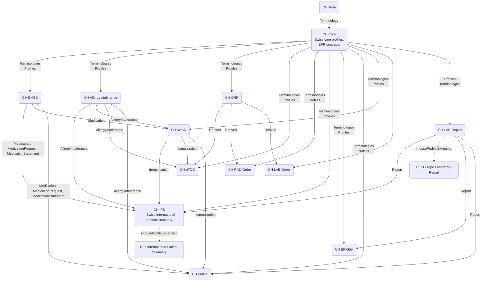

### Übersicht Austauschformate

```mermaid
---
config:
  layout: dagre
---
flowchart TD 
    Term("CH Term") -- Terminology --> CORE("CH Core
    Swiss core profiles, 
    EPR concepts")
    CORE -- Terminologies
    Profiles ---> MED("CH EMED") & AI("CH AllergyIntolerance") & ORF("CH ORF") & ETOC("CH eTOC") & RADO("CH RAD-Order")  &  CIPS("CH IPS
    Swiss International Patient Summary") & EPREG(CH EPREG) & EMER(CH EMER)
    MED -- Medication, MedicationRequest, MedicationStatement  ---> CIPS
    %%IPS
    VAC -- Immunization ---> CIPS
    AI -- AllergyIntolerance ---> CIPS
    LABR -- Report ---> CIPS
    CIPS -. imposeProfile Extension .-> IPS("HL7 International Patient Summary")
    %%VACD
    CORE -- Terminologies
    Profiles ----> VAC("CH VACD")
    MED -- Medication --> VAC
    AI -- AllergyIntolerance --> VAC
    %%ETOC
    AI -- AllergyIntolerance --> ETOC
    VAC -- Immunization --> ETOC
    %%ORF
    ORF -- Derived ---> ETOC & RADO & LABO("CH LAB-Order")
    %%LABO
    CORE --> LABO
    %%LABR
    CORE-- Profiles
    Terminologies --> LABR("CH LAB-Report")
    LABR -. imposeProfile Extension .-> LABRE("HL7 Europe Laboratory Report")
    %%EPREG
    LABR -- Report ----> EPREG
    %%EMER
    MED -- Medication, MedicationRequest, MedicationStatement  ------> EMER
    VAC -- Immunization ----> EMER
    AI -- AllergyIntolerance ----> EMER
    LABR -- Report --> EMER
```
